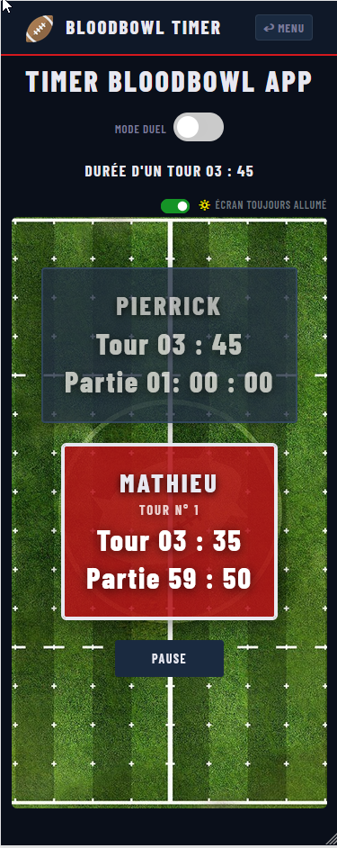

# 🏈 Blood Bowl Timer

> Une application web responsive (Single Page Application) conçue pour chronométrer et rythmer les tours de jeu du célèbre jeu de plateau **Blood Bowl**. 

🔗 **[Accéder à l'application en ligne](https://1316-dev.github.io/bloodbowl-timer/)**

---

## 📌 Présentation du projet

Dans le cadre du jeu de plateau Blood Bowl, la gestion du temps par tour est cruciale pour maintenir le rythme et l'intensité des matchs. Cette application offre une solution mobile et accessible directement sur le terrain (à côté du plateau) pour automatiser le décompte des tours et le temps imparti à chaque coach. Le calcul du temps moyen par tour permet également aux joueurs de se projeter sur la durée globale de la partie.

### Fonctionnalités clés
* ⏱️ **Chronomètre asynchrone :** Gestion précise du temps par tour avec décompte visuel en temps réel et calcul de la moyenne de temps par tour.
* 🔄 **Alternance des tours :** Passage instantané d'un joueur à l'autre avec réinitialisation automatique du timer.
* ⏸️ **Gestion des pauses :** Possibilité de suspendre le temps à tout moment (gestion des litiges ou des mi-temps).
* 📱 **Design Mobile-First :** Interface entièrement responsive, pensée pour une utilisation sur smartphone ou tablette au bord du plateau.
* 🔄 **Mode Duel :** rotation automatique de l'affichage pour les parties en face à face
* 📶 **Mode Hors-ligne (PWA) :** L'application est installable et reste 100% fonctionnelle même sans connexion internet.
* 🔆 **API Screen Wake Lock :** pour maintenir l'écran allumé pendant la partie (toggle on/off)

---

## 🛠️ Architecture & Choix Techniques

Le projet suit une architecture **MVC (Model-View-Controller)** en Vanilla JavaScript.

* **HTML5 Semantic :** Structuration propre du DOM pour garantir une bonne accessibilité.
* **Bootstrap 5 & CSS3 :** Utilisation du framework CSS combiné à des ajustements personnalisés pour concevoir une interface moderne, thématique et responsive.
* **Vanilla JavaScript (ES6+) :** Programmation de toute la logique métier côté client :
  * Utilisation d'algorithmes de gestion du temps basés sur l'asynchronisme JavaScript (`setInterval`, `clearInterval`).
  * Manipulation dynamique du DOM pour mettre à jour l'affichage et les statistiques en temps réel selon l'état du jeu.
* **Progressive Web App (PWA) & API Web avancées :**
  * Implémentation d'un **Web App Manifest** pour permettre l'installation de l'application sur l'écran d'accueil des appareils mobiles.
  * Mise en place d'un **Service Worker** pour gérer la mise en cache des ressources critiques (HTML, CSS, JS, images), garantissant un fonctionnement optimal hors-ligne.
  * Exploitation de l'API **Screen Wake Lock** pour maintenir l'écran de l'appareil allumé pendant toute la durée du match, évitant ainsi les verrouillages intempestifs en cours de jeu.
  * Utilisation du **LocalStorage** pour la persistance des données, permettant de sauvegarder et de restaurer l'état de la partie en cours en cas de fermeture accidentelle du navigateur.

---

## 🚀 Installation et Déploiement Local

### Prérequis
Aucun serveur ni base de données requis. Un simple navigateur web suffit.

### Lancement en local
git clone https://github.com/1316-dev/bloodbowl-timer.git

